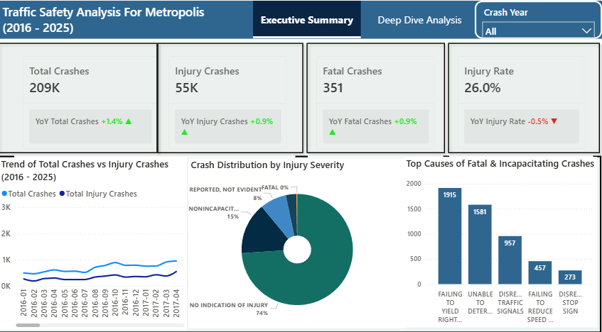
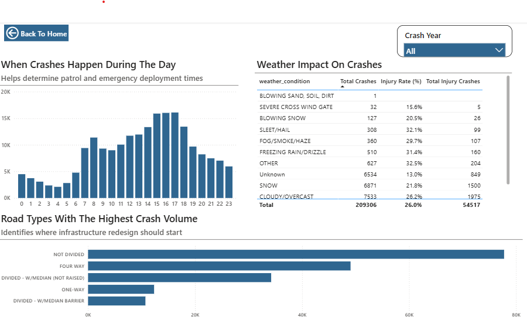
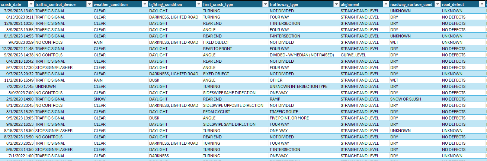

# Metropolis-Traffic-Safety-Analysis
This project analyzes traffic crash data for Metropolis between 2016 and 2025. 

The objective is to identify crash patterns, severity trends, environmental impacts, and behavioral risk factors to support data-driven traffic safety decisions.

## Executive Dashboard

The dashboard was built using Power BI and includes an Executive Summary and Deep Dive Analysis page.

## Objectives
- Analyze overall crash trends (2016–2025)

- Evaluate injury and fatal crash patterns

- Identify top causes of severe crashes

- Examine time-of-day crash distribution

- Assess weather impact on crash frequency and severity

- Identify high-risk road types

- Provide actionable safety recommendations

## Key Metrics (2016 - 2025)

| Metric         | Value   |
| -------------- | ------- |
| Total Crashes  | 209,306 |
| Injury Crashes | 54,517  |
| Fatal Crashes  | 351     |
| Injury Rate    | 26.0%   |

## Year-over-Year Changes Insight
While total crashes are slightly increasing year-over-year, injury severity is not rising proportionally, indicating marginal improvements in crash outcomes.

## Crash Trend Analysis

The line chart comparing Total Crashes vs Injury Crashes shows:

- Gradual upward trend in total crashes.

- Injury crashes follow a similar but slower growth pattern.

- No major volatility spikes across the period.

Implication:
Traffic volume or urban activity may be increasing steadily, contributing to rising crash counts.

## Crash Severity Distribution
| Severity Category         | Share |
| ------------------------- | ----- |
| No Indication of Injury   | 74%   |
| Non-Incapacitating Injury | 15%   |
| Reported, Not Evident     | 8%    |
| Fatal                     | <1%   |

### Insight:

Majority of crashes are non-fatal.

Fatal crashes are rare but operationally significant.

Policy focus should extend beyond fatalities to injury reduction strategies.

## Top Causes of Fatal & Incapacitating Crashes

- Failing to Yield Right of Way – 1,915

- Unable to Determine – 1,581

- Disregard Traffic Signals – 957

- Failing to Reduce Speed – 457

- Disregard Stop Sign – 273

Observations:

- Intersection-related violations dominate severe crashes.

- Behavioral issues are primary contributors.

- High “Unable to Determine” category suggests data quality gaps.

## Deep Dive Analysis Dashboard

## Time-of-Day Analysis

Crash peaks occur between 3 PM and 6 PM, with the highest around 4–5 PM.

Lowest crash volumes occur between 1 AM and 5 AM.

Implications:

- Afternoon rush hour congestion increases risk exposure.

- Enforcement and patrol allocation should prioritize peak commuting hours.

## Weather Impact on Crashes

### Highest crash volumes:

- Cloudy/Overcast - 7,533

- Snow - 6,871

- Unknown (Unreported weather condition) - 6,534

### Highest injury rates:

- Other (Miscellaneous cases) - 32.5%

- Sleet/Hail - 32.1%

- Freezing Rain/Drizzle - 31.4%

### Key Insight:

- Snow increases crash frequency.

- Freezing conditions increase injury severity.

- Road surface condition is more predictive of injury severity than visibility alone.

## Road Type Risk Analysis

### Highest crash volumes:

- Not Divided Roads (~80K)

- Four-Way Intersections (~50K)

### Lower crash volumes:

- One-Way Roads

- Divided with Median Barrier

### Conclusion:
Undivided road infrastructure significantly increases crash exposure.
Median barriers appear to reduce conflict severity.

## Data Cleaning & Transformation (Power Query)

Before modeling, the dataset underwent structured cleaning and transformation:

### Dataset Preview

### Data Type Standardization

- Date columns converted to proper Date format.

- Crash hour converted to numeric format.

- Categorical fields standardized as text.

- Numeric fields validated to prevent aggregation errors.

### Column Optimization

- Removed irrelevant or redundant columns.

- Renamed fields for clarity and consistency.

- Simplified column names to align with modeling standards.

### Data Validation

- Verified absence of null values in critical fields.

- Confirmed no duplicate crash records.

- Checked injury severity categories for consistency.

- Ensured crash hour values ranged correctly from 0–23 (24 hour format).

### Sorting & Time Intelligence Preparation

- Created Month Number column to correctly sort Month Name.

- Generated Year-Month structure for chronological trend analysis.

- Built a separate Date table to enable accurate Year-over-Year calculations.

## DAX & KPI Design Approach

Instead of relying on calculated columns, measures were used to dynamically compute:

- Total Crashes

- Injury Crashes

- Fatal Crashes

- Injury Rate

- Year-over-Year changes

### Key modeling principles applied:

- Time intelligence functions for YoY comparison.

- Filter context management to ensure correct slicer interaction.

- Use of variables in complex measures for performance and readability.

- Conditional formatting logic for KPI directional indicators.

All calculations were designed to remain dynamic under slicer selections (e.g., Crash Year filter).

## Tools Used

- Power BI (Data modeling & visualization)

- DAX (Dynamic KPI calculations & time intelligence)

- Power Query (Data cleaning and transformation)

## Conclusion
Metropolis faces a steady increase in traffic crashes, largely driven by behavioral violations and peak-hour congestion. While fatal crash rates remain low, injury rates remain significant and demand focused intervention. Infrastructure redesign and targeted enforcement can meaningfully reduce crash frequency and severity.

## Links
[Interactive Power BI Dashboard](https://app.powerbi.com/view?r=eyJrIjoiOWJlNTQ0YzgtOTczMC00N2E4LThkZjgtMjMzYzlmNWUzMmRkIiwidCI6IjdlYzcyZWRiLTczY2UtNGNjOC1hODI1LWNiYzhjY2Y4NzZlZSJ9)

